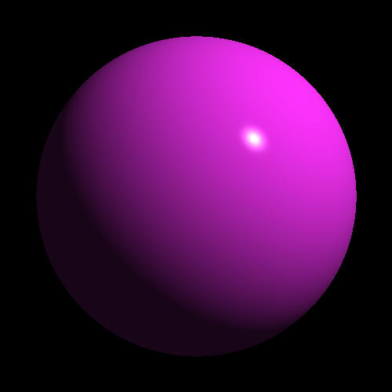
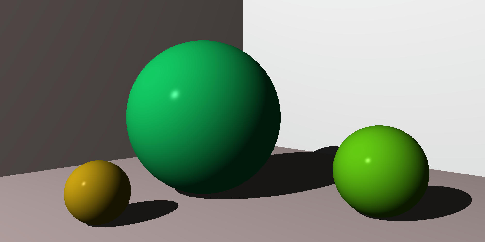
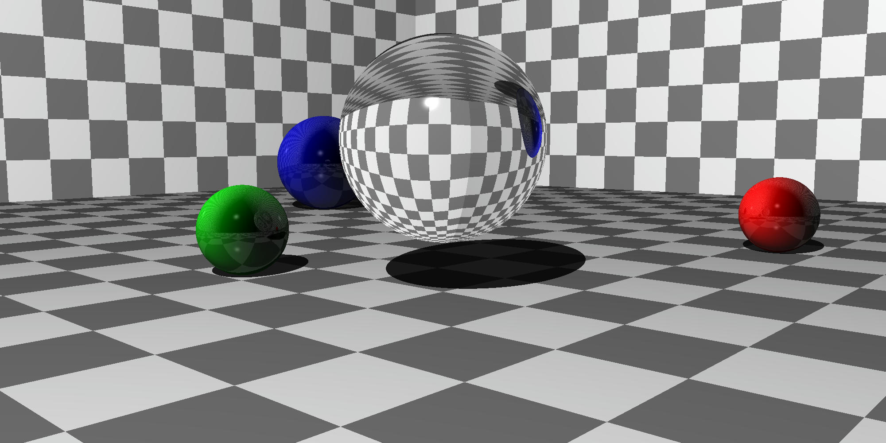
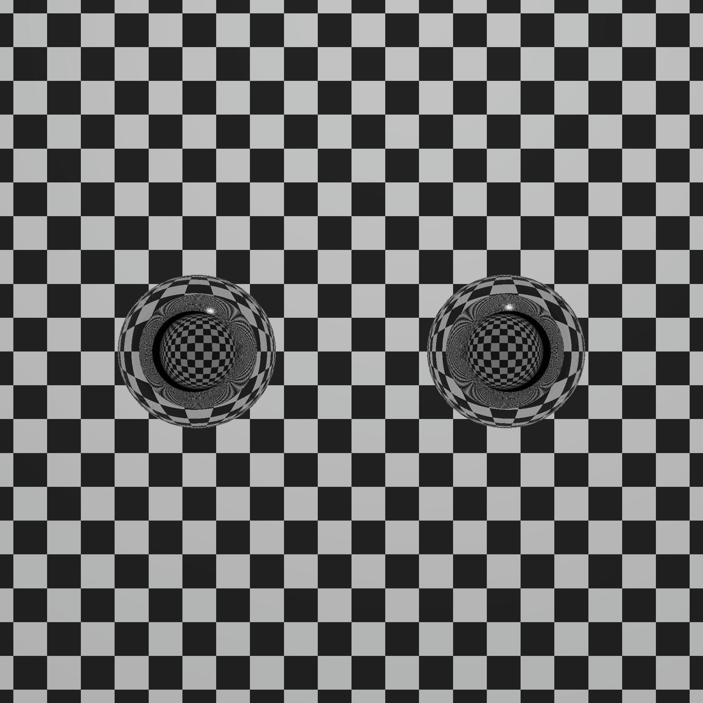

# Ray Tracer

A ray tracer implemented in Rust, capable of rendering realistic 3D scenes with advanced lighting effects including reflections, refractions, and shadows.

## Features

- **Geometric Primitives**
  - Spheres
  - Planes
  - Cubes
  - Cylinders
  - Cones

- **Material Properties**
  - Colors and patterns
  - Ambient, diffuse, and specular lighting
  - Reflection
  - Transparency and refraction
  - Shadows

- **Lighting**
  - Point lights
  - Multiple light sources
  - Shadow casting

- **Camera**
  - Configurable field of view
  - Customizable resolution
  - View transformations

## Example Scenes

The project includes several example scenes in the `src/bin` directory:
- `ch5.rs`: Basic sphere rendering
- `ch6.rs`: Scene with multiple spheres and walls
- `ch7.rs`: Advanced scene with reflective and refractive objects
- `sphere_in_sphere.rs`: Demonstration of nested transparent spheres

### Rendered Images

The ray tracer outputs images in PPM format, which can be viewed using various image viewers or converted to more common formats. The following images are generated in the `samples` directory:


*Basic sphere with lighting*


*Scene with reflective and refractive objects*


*Advanced scene with multiple objects*


*Nested transparent spheres*

To view PPM files, you can:
1. Use an image viewer that supports PPM format
2. Convert them to PNG or JPEG using ImageMagick:
   ```bash
   convert samples/chapter_7.ppm samples/chapter_7.png
   ```
3. Use online PPM viewers

## Building and Running

1. Ensure you have Rust installed on your system
2. Clone the repository
3. Build the project:
   ```bash
   cargo build --release
   ```
4. Run any of the example scenes:
   ```bash
   cargo run --bin ch7
   ```

The rendered images will be saved as PPM files in the `samples` directory.

## Dependencies

- `approx`: For floating-point comparisons
- `pretty_assertions`: For testing

## Project Structure

- `src/rtc/`: Core ray tracing implementation
  - `camera.rs`: Camera and rendering logic
  - `intersection.rs`: Ray-object intersection calculations
  - `material.rs`: Material properties and lighting
  - `object.rs`: Geometric primitives
  - `pattern.rs`: Surface patterns
  - `ray.rs`: Ray definition and operations
  - `world.rs`: Scene management
- `src/primitives/`: Basic mathematical types
- `src/bin/`: Example scenes
- `samples/`: Output directory for rendered images

## License

This project is open source and available under the MIT License.
